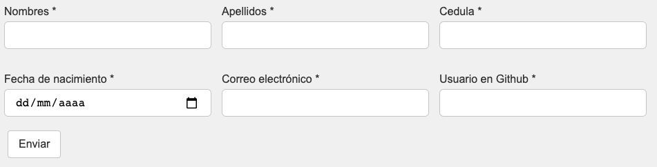
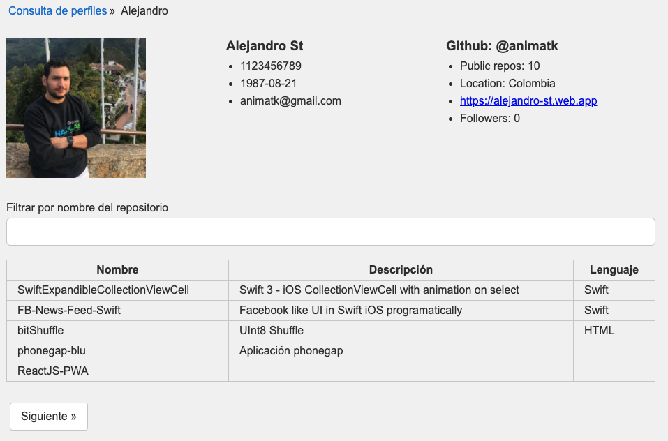
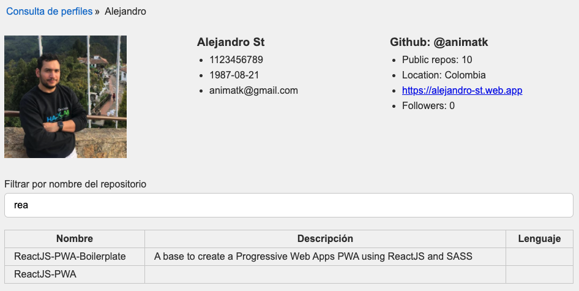

# ReactJS Github API Search

This is a ReactJS web App that provides API info about Github users and theirs repositories.

This source use Webpack and requires **NodeJS** v8.11.0 and **NPM** to run.

To start develoment, after clone this repository run in the saved directory.

```
npm install
```

To start develoment watcher (included local server)

```
npm run start
```

## Screenshots

### Form


### Details


### Filter


## Notes

- The repositories API only list non archived repositories. 
- The Github API in non authenticated calls only allows 10 calls per minute.